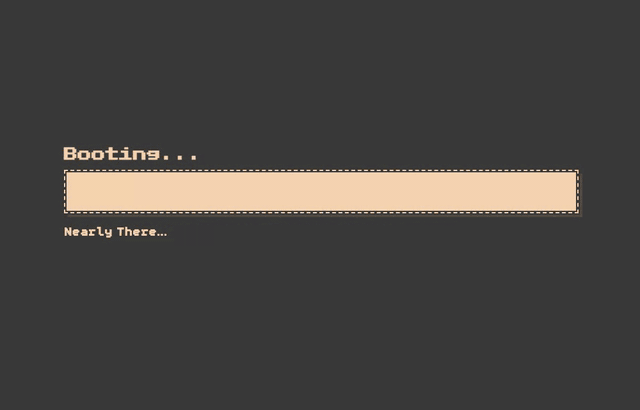

# Portfolio v1 — the retro computer (2024–2026)

My first portfolio: a 3D Commodore on your screen with a working
terminal inside it — a tiny UNIX shell, a virtual file system, and a
markdown renderer drawn onto the machine's CRT.



**This site has been succeeded by v2** — a from-scratch rebuild with a
floating terminal and a RAG agent living inside it:
**[shauryagulati.me](https://shauryagulati.me)** ·
[source](https://github.com/Shauryagulati/portfolio-v2)

## Credit where it belongs

v1 was built on [Edward Hinrichsen](https://edh.dev)'s brilliant
open-source retro computer portfolio (MIT license) — the 3D scene,
shell, and rendering architecture are his craft. My contribution was
the content and adaptation. v2 exists partly because a portfolio
should be one's own engineering end to end; its ASCII-rendered CRT is
a tip of the hat to this machine.

## Stack

TypeScript · Three.js · Vite. The terminal renders to a texture on the
computer's screen; the whole site runs client-side.

## Run it

```bash
npm install
npm run dev      # local server
npm run build    # production build
```
